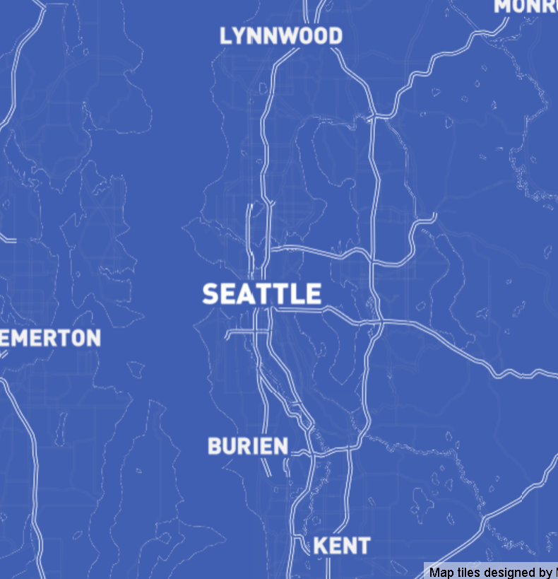
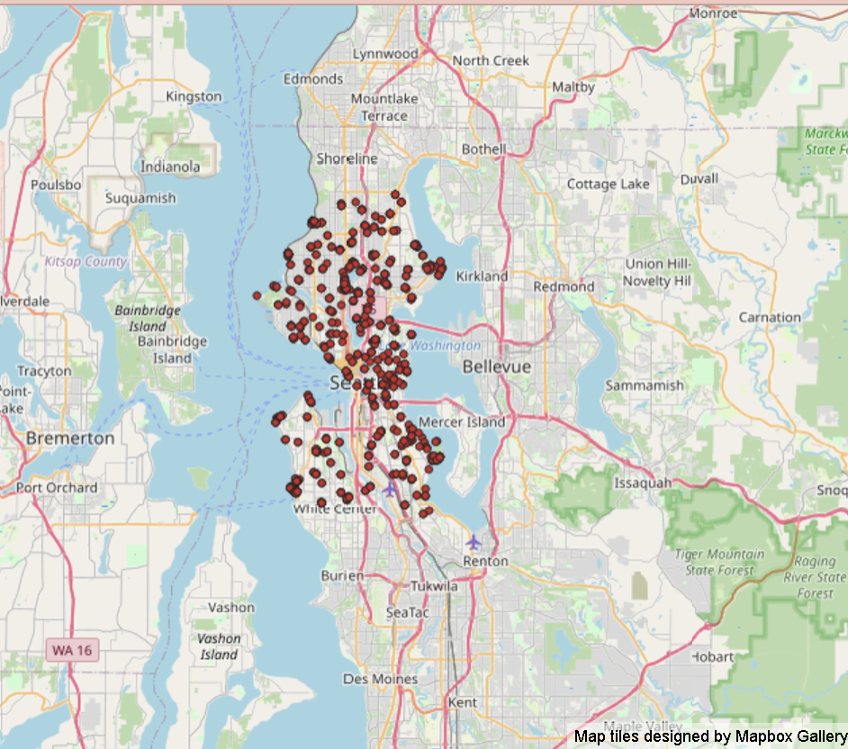
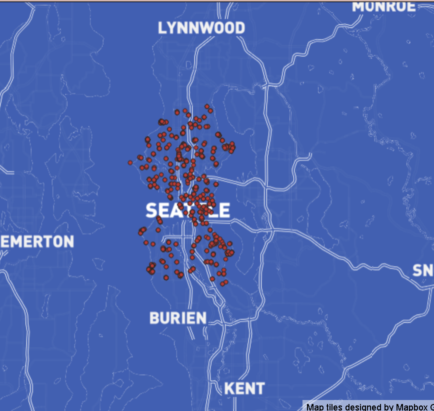
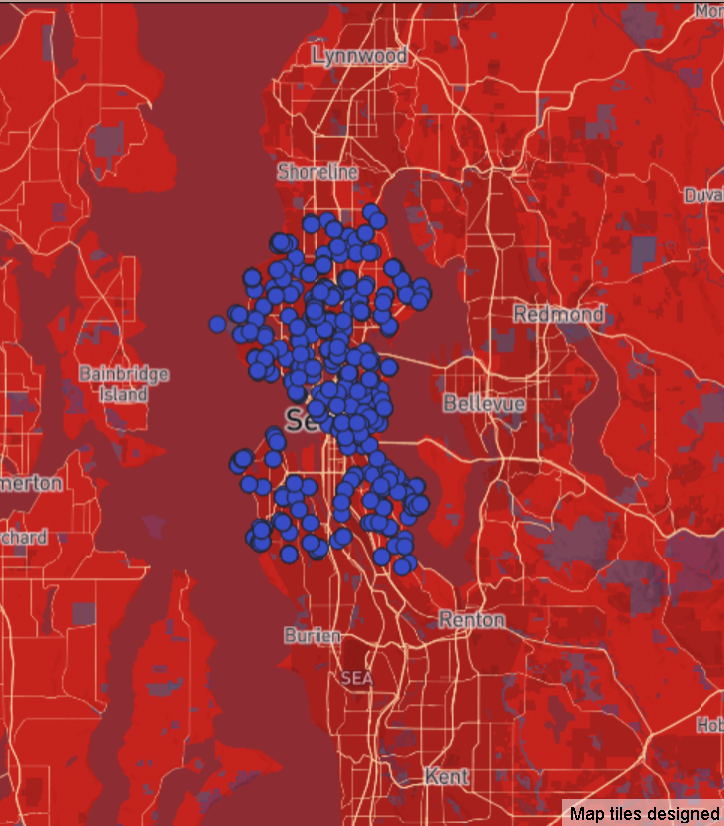

## Tile Generation
This lab was a practice in using QMetaTiles a QGIS plugin that allows you to download map tiles. Using Mapbox and WTMS connections I downloaded tiles of four different basemaps, and included a semantic layer that represents picnic table spots in Seattle. Using this method I can host my own tiles on my Github repo, without needing to make a call to the Mapbox API.

All four map tile collections are set to show the greater Seattle area.

### Map 1: Blueprint

Blueprint is a mapbox basemap that was collected from the Mapbox Studio gallery.

### Map 2: Picnic

Semantic layer showing picnic tables obtained from Seattle OpenData and OpenStreetMap

### Map 3: Blueprint Picnic

Blueprint is a mapbox basemap that was collected from the Mapbox Studio gallery. Combined with the earlier semantic layer showing picnic tables in Seattle.

### Map 4: Lunar

Lunar is a Mapbox map i made using custom styles by images. I included an image of a lunar new year celebration. Combined with the picnic semantic layer.

